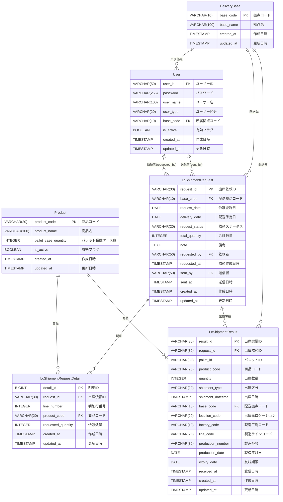

# LC自動倉庫出庫指示システム データモデル図

## ERD（Entity Relationship Diagram）

## テーブル一覧

### マスタテーブル
1. **Product（商品マスタ）** - 商品の基本情報を管理
2. **DeliveryBase（配送拠点マスタ）** - 配送拠点の基本情報を管理（CSV受信、全量入れ替え）
3. **User（ユーザーマスタ）** - システム利用者の情報を管理

### トランザクションテーブル
4. **LcShipmentRequest（LC出庫依頼テーブル）** - 配送拠点への出庫依頼情報を管理
5. **LcShipmentRequestDetail（LC出庫依頼明細テーブル）** - 出庫依頼の明細（商品単位）を管理
6. **LcShipmentResult（LC出庫実績テーブル）** - LC自動倉庫からの出庫実績情報を管理（Webhook受信）

## REST API化に伴う削除テーブル
- **LcInventory（在庫情報）** - REST APIで都度取得、DB保存なし
- **InterfaceReceiveLog（インタフェース受信ログ）** - アプリケーションログで管理
- **InterfaceSendLog（インタフェース送信ログ）** - アプリケーションログで管理

## 主要リレーションシップ

### マスタとトランザクション
- 商品マスタ → 出庫依頼明細（1:多）
- 商品マスタ → 出庫実績（1:多）
- 配送拠点マスタ → ユーザー（1:多）
- 配送拠点マスタ → 出庫依頼（1:多）
- 配送拠点マスタ → 出庫実績（1:多）

### ユーザーと出庫依頼
- ユーザー → 出庫依頼（依頼者）（1:多）
- ユーザー → 出庫依頼（送信者）（1:多）

### 出庫依頼と明細・実績
- 出庫依頼 → 出庫依頼明細（1:多）
- 出庫依頼 → 出庫実績（1:0以上）※手動出庫の場合は紐付けなし

## インデックス設計

### Product（商品マスタ）
- PK: product_code

### DeliveryBase（配送拠点マスタ）
- PK: base_code

### User（ユーザーマスタ）
- PK: user_id
- idx_user_type (user_type)
- idx_user_base (base_code)

### LcShipmentRequest（LC出庫依頼）
- PK: request_id
- idx_request_status (request_status)
- idx_request_base_date (base_code, delivery_date)
- idx_request_date (request_date)

### LcShipmentRequestDetail（LC出庫依頼明細）
- PK: detail_id
- idx_detail_request (request_id, line_number)

### LcShipmentResult（LC出庫実績）
- PK: result_id
- idx_result_request (request_id)
- idx_result_pallet (pallet_id)
- idx_result_shipment_date (shipment_datetime)
- idx_result_base_date (base_code, shipment_datetime)
- idx_result_product (product_code)
- idx_result_expiry (expiry_date)

## ステータス値

### request_status（依頼ステータス）
- `作成済` - 拠点倉庫担当が登録
- `送信済` - LC倉庫担当が送信完了（=完了）
- `エラー` - 送信失敗

### user_type（ユーザー区分）
- `拠点倉庫担当` - 所属拠点のみ操作可能
- `LC倉庫担当` - 全拠点のデータを操作可能
- `管理者` - ユーザー管理のみ

### shipment_type（出庫区分）
- `自動` - 出庫依頼に基づく自動出庫
- `手動` - 緊急出庫・廃棄など（依頼との紐付けなし）
